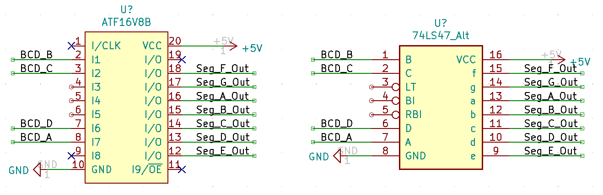
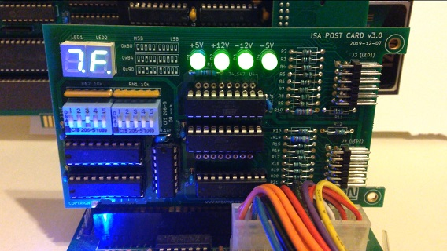

# HEX_TO_7SEG_DECODER_COMMON_ANODE_V1.2

A WinCUPL project enabling an ATF16V8B chip to emulate a 74LS47 seven segment display decoder IC with additional/new hex-output functionality.

## Software

Project files created under WinCUPL version 5.30.4

WinCUPL can be found on the [PLD Design Resources page](https://pages.github.com/) of the Microchip website as of 2020/10/8.

[Direct link to WinCUPL installer](http://ww1.microchip.com/downloads/archive/awincupl.exe) that may or may not break in future. Microchip suggests serial number 60008009.

## Hardware Emulation

The ATF16V8B PLD is programmed to emulate the pin-out of the 74LS47 seven segment display decoder IC. This can only be a close approximation as the ATF16V8B is a 20 pin device and the 74LS47 is a 16 pin device. 

See comparison:

Wire the ATF16V8B chip according to the pinout above.

## Software Emulation

The ATF16V8B is programmed to mimic the 74LS47 seven segment display decoder IC with expanded functionality in the form of an ability to display hexadecimal characters corresponding to BCD inputs in the hexadecimal range.

The 74LS47 Ripple Blanking Input, Lamp Test Input, Blanking Input, and Ripple Blanking Output are NOT implemented to keep code size down.

The ATF16V8B is programmed to produce inverted outputs suitable for driving a Common Anode seven segment display (i.e. to mimic the 74LS47).

## Implementation

The "HEX_TO_7SEG_DECODER_COMMON_ANODE_V1.2.jed" file is the compiled output of the WinCUPL project.

The "HEX_TO_7SEG_DECODER_COMMON_ANODE_V1.2.jed" file can be directly used to program an ATF16V8B PLD chip and achieve conversion of hexadecimal-range BCD inputs for display of hexadecimal characters on a Common Anode seven segment display:

